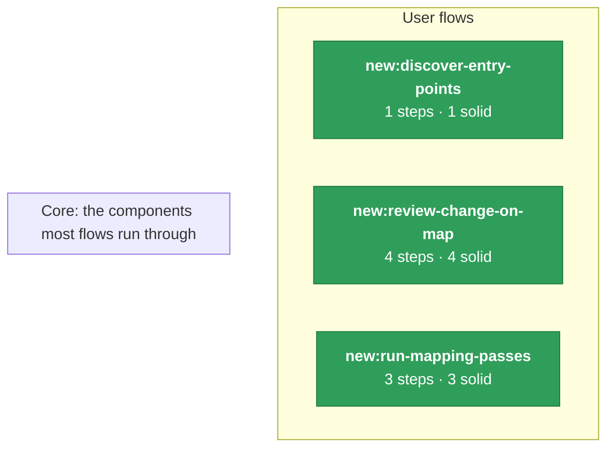

# System map

_Generated by `tools/flowmap/diagrams.py` from `map.json` + the call graph. Do not hand-edit._

Left: user flows (click to drill in), coloured by how much of the flow the map is sure of (green ≥75% of steps tested/agreed · light green ≥50% · amber below). Right: backend components that two or more flows run through. A line means 3+ of that flow's steps reach the component (call graph); its number is how many. Weaker ties are in the matrix. Plumbing reached from most endpoints (auth, sessions) and data classes are hidden so the lines mean something.

## Shared components, widest first

A component many flows run through is where a change has the widest blast radius — and where the system's real core is.

Every component two or more flows share. Cell = how many of the flow's steps reach it.

| component | discover-entry-points | review-change-on-map | run-mapping-passes |
|---|---|---|---|

**workflow engine** = `executor.run_workflow` and everything only it reaches: .

**Hidden as plumbing:** `analytics`, `auth`, `config`, `db`, `logging`, `sentry`, `serialisation`, `settings` (override with `plumbing` in `decisions.json`).

## Flows

- [new:discover-entry-points](./new-discover-entry-points.md) — Maintainer scans the repo being mapped and gets the list of every entry point, the join key for all later passes.
- [new:review-change-on-map](./new-review-change-on-map.md) — See the map: flows, their steps and the code each step runs, as Mermaid diagrams and an interactive atlas page.
- [new:run-mapping-passes](./new-run-mapping-passes.md) — Turn a repo into a first flow map: list its entry points, brief independent mapping passes, check each pass, and vote them into one map.
