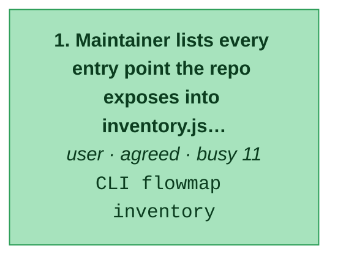
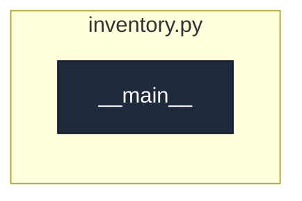

# new:discover-entry-points

_Maintainer scans the repo being mapped and gets the list of every entry point, the join key for all later passes._

[← system map](./README.md) · generated, do not hand-edit

Steps in the order a user meets them. Colour = evidence (dark green confirmed/tested → light green agreed → amber contested → red single-source). Each box lists the endpoints the step calls.

## Code flow per step

Call graph from the step's endpoint handler(s) (dark), grouped by file, depth ≤ 4, plumbing hidden. More boxes and files = a busier step.

### 1. Maintainer lists every entry point the repo exposes into inventory.json

`agreed` · actor user · `CLI flowmap inventory`
· writes `docs/flowmap/inventory.json`

code flow

