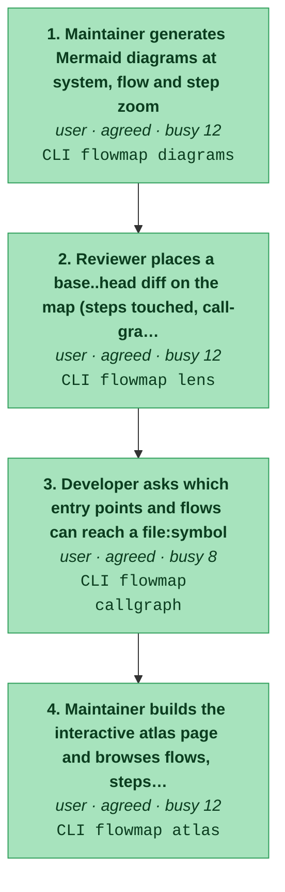
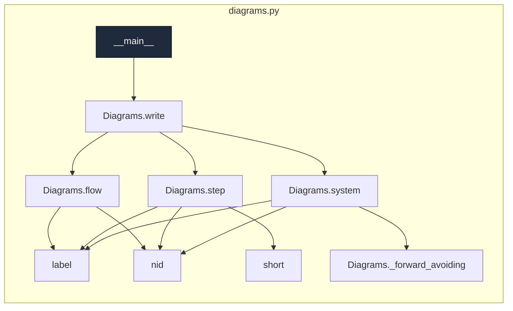
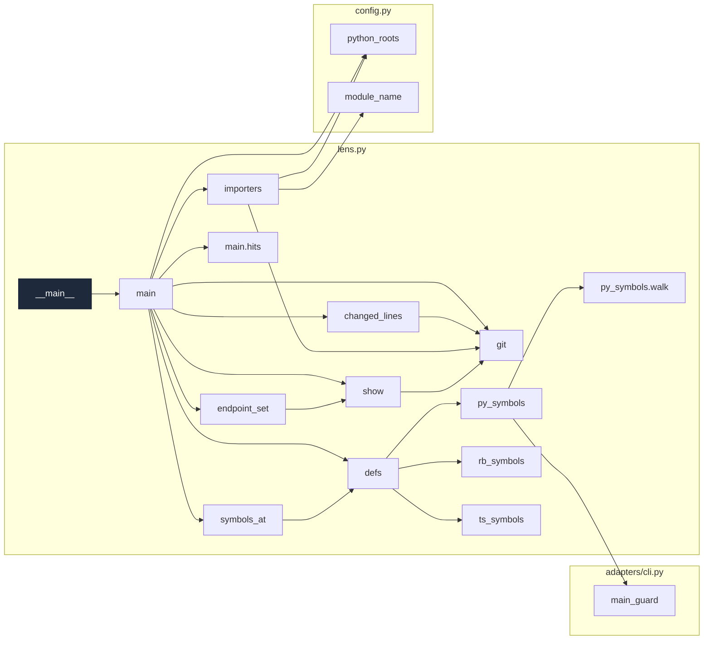
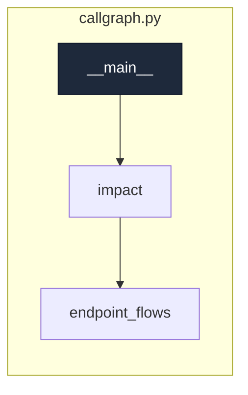
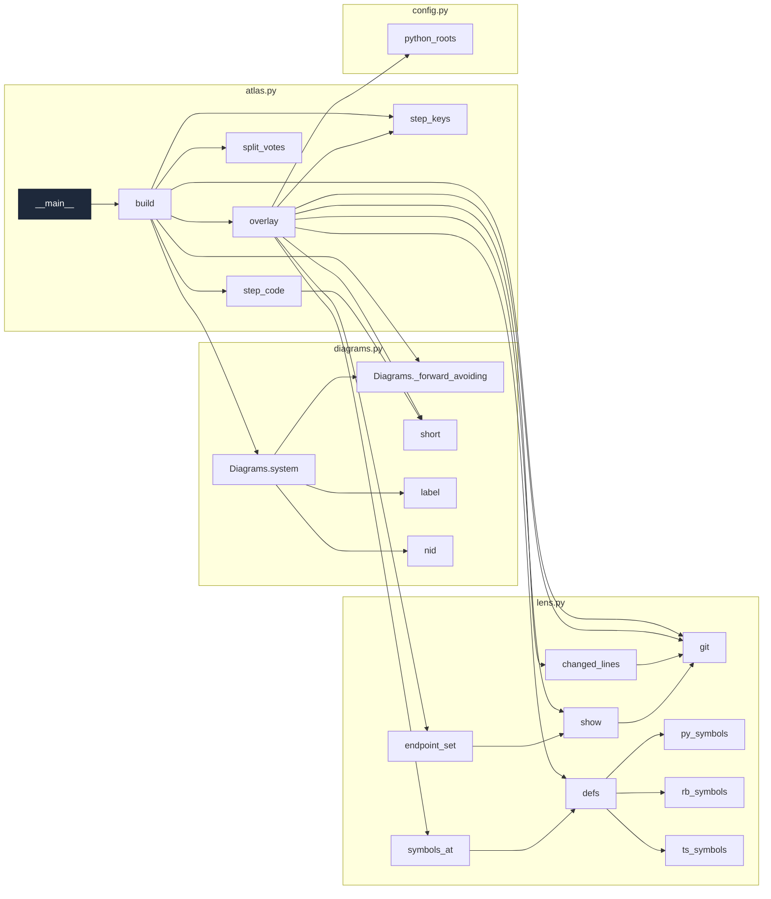

# new:review-change-on-map

_See the map: flows, their steps and the code each step runs, as Mermaid diagrams and an interactive atlas page._

[← system map](./README.md) · generated, do not hand-edit

Steps in the order a user meets them. Colour = evidence (dark green confirmed/tested → light green agreed → amber contested → red single-source). Each box lists the endpoints the step calls.

## Code flow per step

Call graph from the step's endpoint handler(s) (dark), grouped by file, depth ≤ 4, plumbing hidden. More boxes and files = a busier step.

### 1. Maintainer generates Mermaid diagrams at system, flow and step zoom

`agreed` · actor user · `CLI flowmap diagrams`
· writes `docs/flowmap/diagrams/<flow>.md`, `docs/flowmap/diagrams/README.md`

code flow

### 2. Reviewer places a base..head diff on the map (steps touched, call-graph reach, off-map code)

`agreed` · actor user · `CLI flowmap lens`

code flow

### 3. Developer asks which entry points and flows can reach a file:symbol

`agreed` · actor user · `CLI flowmap callgraph`

code flow

### 4. Maintainer builds the interactive atlas page and browses flows, steps and components

`agreed` · actor user · `CLI flowmap atlas`
· writes `docs/flowmap/atlas.html`

code flow

