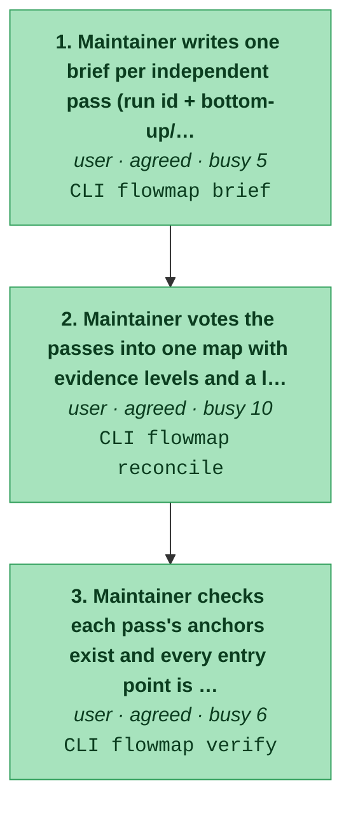
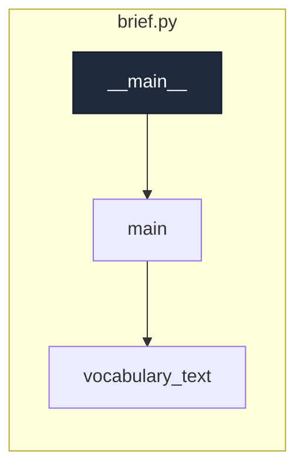
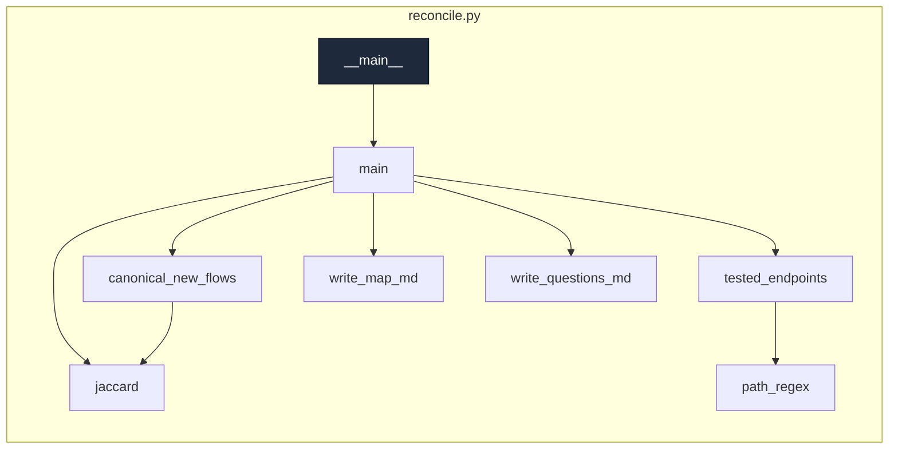
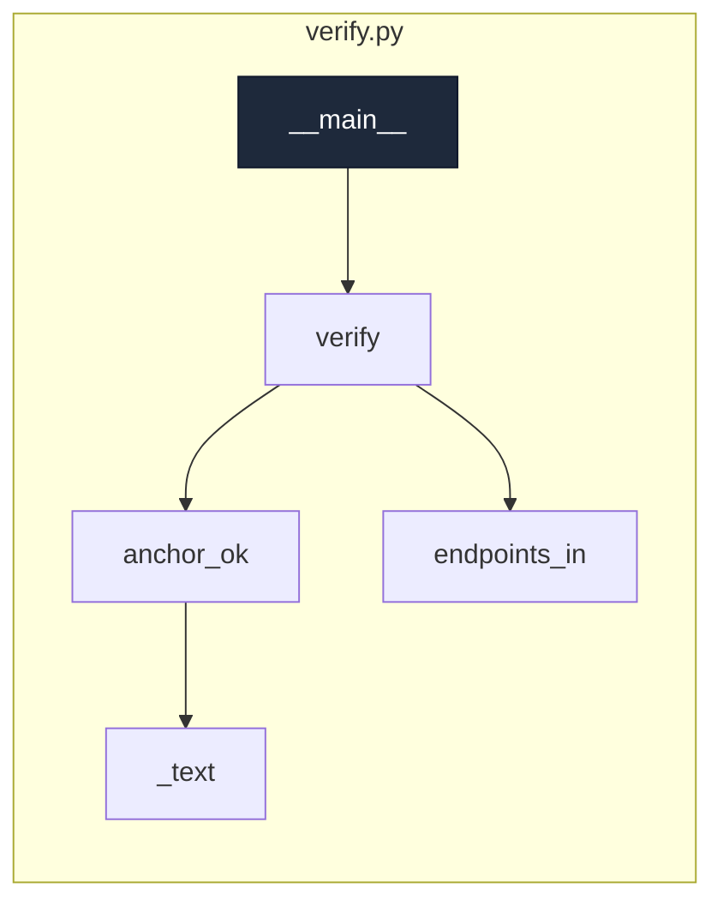

# new:run-mapping-passes

_Turn a repo into a first flow map: list its entry points, brief independent mapping passes, check each pass, and vote them into one map._

[← system map](./README.md) · generated, do not hand-edit

Steps in the order a user meets them. Colour = evidence (dark green confirmed/tested → light green agreed → amber contested → red single-source). Each box lists the endpoints the step calls.

## Code flow per step

Call graph from the step's endpoint handler(s) (dark), grouped by file, depth ≤ 4, plumbing hidden. More boxes and files = a busier step.

### 1. Maintainer writes one brief per independent pass (run id + bottom-up/top-down method)

`agreed` · actor user · `CLI flowmap brief`
· writes `docs/flowmap/runs/<run-id>.brief.md`

code flow

### 2. Maintainer votes the passes into one map with evidence levels and a list of open questions

`agreed` · actor user · `CLI flowmap reconcile`
· writes `docs/flowmap/MAP.md`, `docs/flowmap/QUESTIONS.md`, `docs/flowmap/map.json`

code flow

### 3. Maintainer checks each pass's anchors exist and every entry point is placed

`agreed` · actor user · `CLI flowmap verify`

code flow

